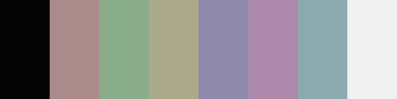

<h3 align="center">Mountaineer.vim</h2>

Embrace the adventurer within you

<h4 align="center">Dark Variant</h4>

<h4 align="center">Gray Variant</h4>

<h4 align="center">Light Variant</h4>

***

### Installation:
Simply move the variant you would like to use into your Vim/Neovim colorscheme folder, A [lightline.vim](https://github.com/itchyny/lightline.vim) colorscheme is also included.

## TODO

- ~~Add schemes for VTE terminals~~
- Add schemes for alacritty/kitty
- Link matching ST build
- Add Openbox theme
